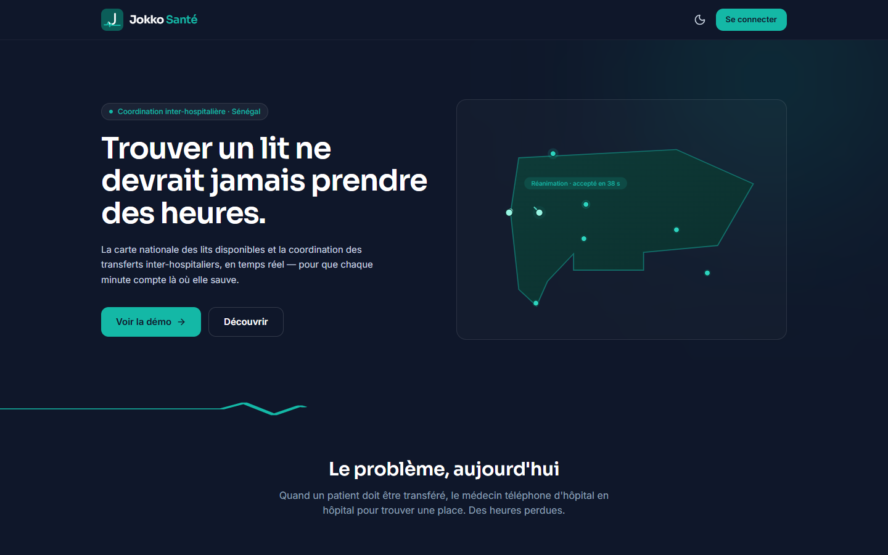
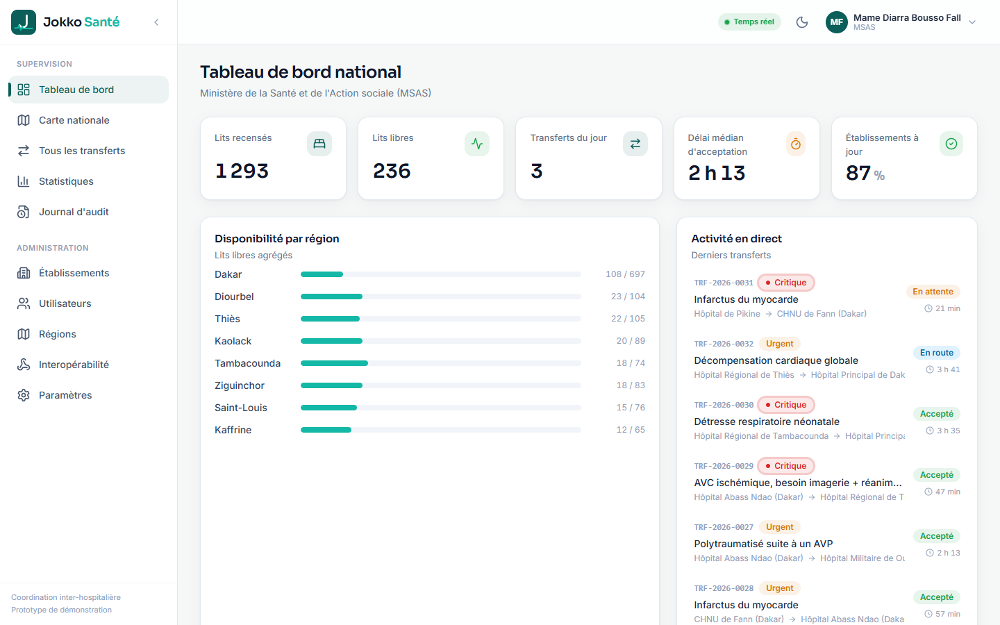
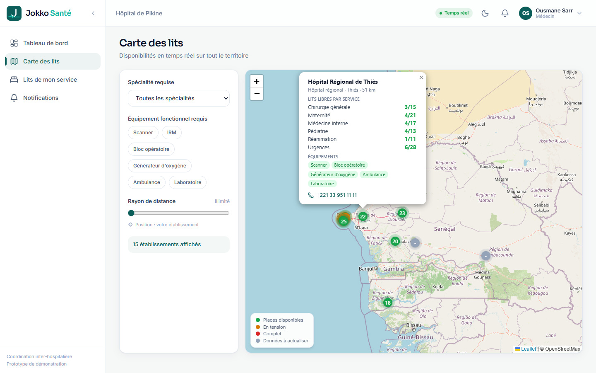
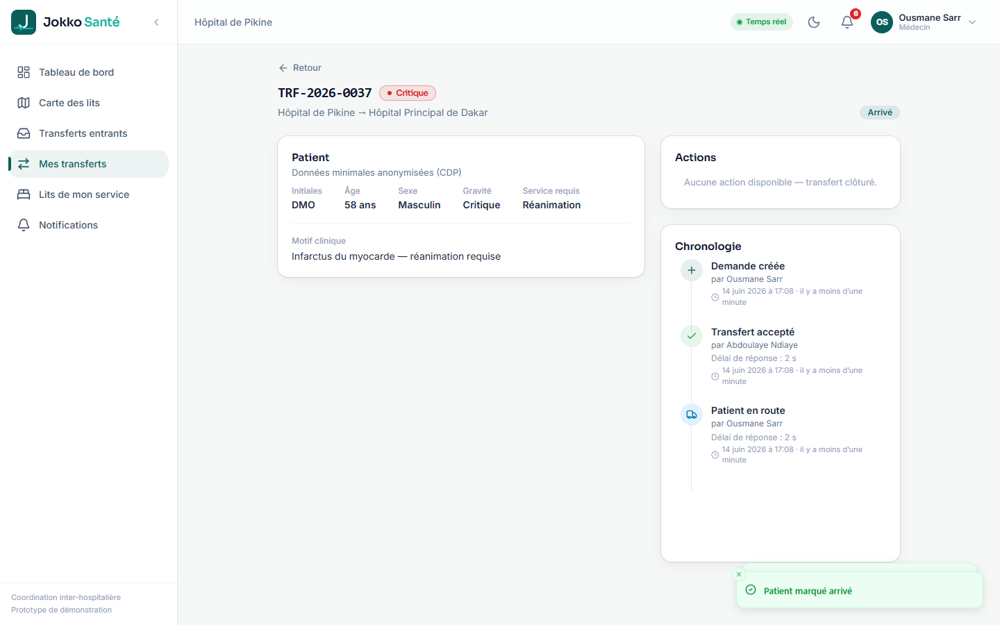
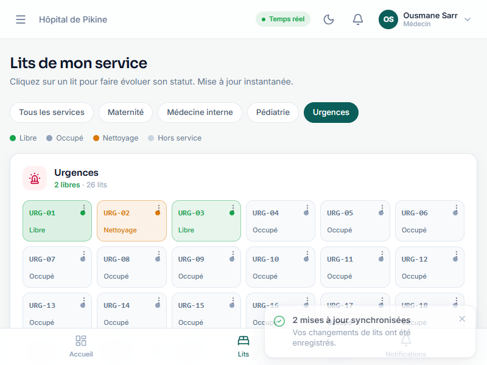
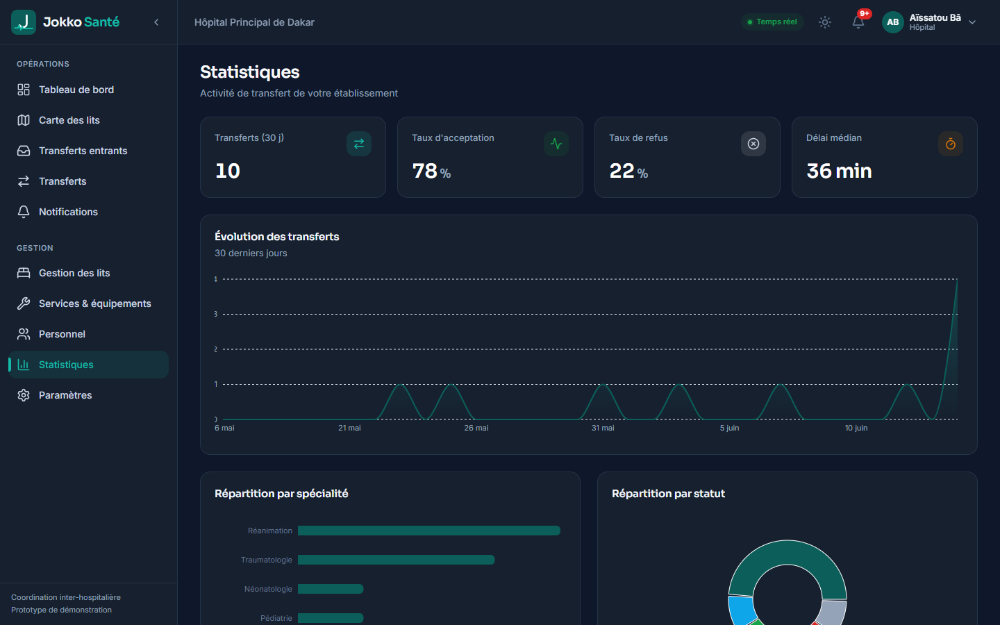
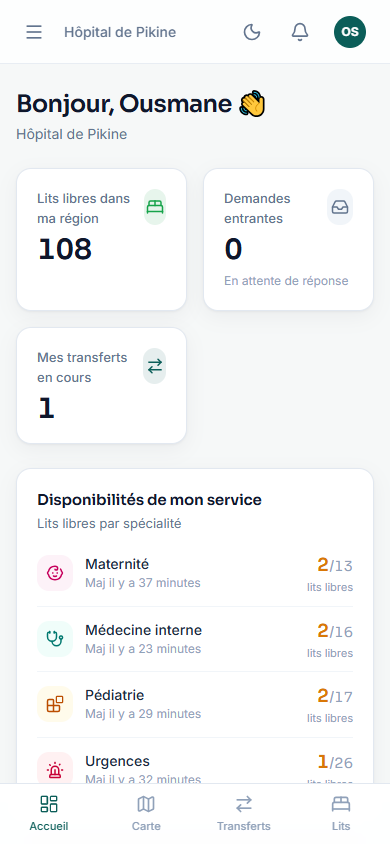

# Jokko Santé

> *« Jokko »* (wolof) : relier, mettre en relation.

**La carte nationale des lits disponibles et la coordination des transferts inter-hospitaliers, en temps réel — pour le Sénégal.**

Aujourd'hui, quand un hôpital doit transférer un patient (réanimation pleine, pas de néonatologie, scanner en panne…), le médecin téléphone d'hôpital en hôpital pour trouver une place. Des heures perdues, des patients qui se dégradent. Jokko Santé digitalise ce parcours : une carte des disponibilités par service et par équipement, et un workflow de demande/acceptation de transfert **tracé, chronométré et anonymisé**.

Jokko Santé est un **module de coordination complémentaire** de l'existant national (Dossier Patient Unique, DHIS2), avec interopérabilité prévue via **HL7 FHIR**. Ce n'est pas un dossier patient : les données y sont minimales et anonymisées (initiales, âge, sexe, motif clinique), conformément aux exigences de la **CDP** (Commission de protection des données personnelles).

---

## Aperçu

| | |
|---|---|
| Landing (vitrine) |  |
| Tableau de bord national (MSAS) |  |
| Carte des lits |  |
| Détail d'un transfert |  |
| Grille des lits (médecin) |  |
| Mode Garde (sombre) + statistiques |  |
| Mobile (390 px) |  |

---

## Fonctionnalités clés

- **Carte nationale temps réel** (Leaflet + OpenStreetMap, sans clé API) : marqueurs colorés selon la disponibilité, filtres par spécialité / équipement fonctionnel / rayon de distance, popups riches, tri par distance (géolocalisation).
- **Gestion des lits ultra-rapide** : tuiles cliquables qui cyclent libre → occupé → nettoyage → hors service, mise à jour **optimiste** et synchronisation **temps réel** entre tous les écrans.
- **Mode hors-ligne** : cache de lecture persistant, file d'attente d'écriture des lits rejouée automatiquement au retour du réseau, bandeau global et badges « en attente de synchro ».
- **Transferts** : formulaire en 3 étapes avec suggestions intelligentes de destination, acceptation/refus chronométré, timeline immuable, mini-carte avec ambulance animée, notifications temps réel.
- **4 espaces par rôle** : médecin, admin hôpital, admin régional, super-admin (MSAS) — chacun avec ses tableaux de bord, statistiques (Recharts), et outils d'administration.
- **Statistiques avec historique d'occupation réel** : instantanés quotidiens des lits (table `bed_snapshots`) → courbes d'occupation historiques, en plus des analyses de transferts (Recharts).
- **Interopérabilité HL7 FHIR** : API standard exposant les disponibilités sous forme de *Bundle FHIR R4* (ressources `Location`), consommable par le DPU / DHIS2 — avec une page de supervision dédiée.
- **Gestion des comptes côté serveur** : création et réinitialisation de mot de passe via une **Edge Function** (clé `service_role` côté serveur), avec repli côté client si la fonction n'est pas déployée.
- **Conformité** : RLS « deny by default » sur 100 % des tables, journal d'audit complet, anonymisation des données patient.
- **PWA installable**, **mode Garde** (sombre) pour les gardes de nuit, **accessibilité** (focus, labels, contrastes AA, `prefers-reduced-motion`).

---

## Stack technique

Vite · React 18 · TypeScript strict · Tailwind CSS · TanStack Query · React Router v6 · react-hook-form + zod · Framer Motion · Leaflet · Recharts · lucide-react · date-fns · **Supabase** (PostgreSQL + Auth + Row Level Security + Realtime) · vite-plugin-pwa.

---

## Installation

### Prérequis
- **Node.js 18+** et npm
- Un projet **Supabase** (palier gratuit suffisant)

### 1. Dépendances
```bash
npm install
```

### 2. Variables d'environnement
Copier `.env.example` en `.env` et renseigner les valeurs depuis le dashboard Supabase (**Project Settings → API Keys**) :
```
VITE_SUPABASE_URL=https://xxxx.supabase.co
VITE_SUPABASE_ANON_KEY=sb_publishable_...   # clé publique
SUPABASE_SERVICE_ROLE_KEY=sb_secret_...     # clé secrète — UNIQUEMENT pour le seed local
SUPABASE_DB_PASSWORD=...                     # mot de passe base de données
```
> La clé secrète n'est jamais importée dans `src/` ni incluse dans le bundle client (vérifié au build).

Dans Supabase : **Authentication → Sign In / Providers → Email → décocher « Confirm email »** (les comptes sont créés par les administrateurs, sans validation par e-mail).

### 3. Migrations de la base
```bash
npm run db:migrate
```
Le script applique les fichiers `supabase/migrations/*.sql` dans l'ordre et découvre automatiquement le pooler régional (la connexion directe Supabase est IPv6-only).
*Solution de secours : coller le contenu des fichiers `supabase/migrations/` dans l'éditeur SQL de Supabase, dans l'ordre (0001 → 0007).*

### 4. Données de démonstration
```bash
npm run seed
```
Peuple 14 régions, 15 établissements réels, ~80 services, ~1300 lits, ~40 profils, ~32 transferts, équipements, notifications et audit cohérents. Idempotent (réinitialise puis réinsère).

### 5. Lancer l'application
```bash
npm run dev          # développement
npm run build        # build de production (typecheck + bundle)
npm run preview      # prévisualiser le build
```

---

## Comptes de démonstration

Mot de passe commun : **`Jokko2026!`**

| Email | Rôle | Usage |
|---|---|---|
| `superadmin@jokkosante.sn` | Super-admin (MSAS) | Vue nationale, CRUD, audit |
| `admin.principal@jokkosante.sn` | Admin Hôpital Principal | Gestion d'un établissement |
| `medecin.pikine@jokkosante.sn` | Médecin urgentiste, Pikine | **Écran A** de la démo |
| `medecin.principal@jokkosante.sn` | Médecin réanimateur, H. Principal | **Écran B** de la démo |
| `region.dakar@jokkosante.sn` | Admin régional Dakar | Vue régionale |

L'écran de connexion propose un bouton « Remplir » pour chaque compte.

---

## Scénario de démo pour le jury (7 étapes)

À jouer sur **deux navigateurs côte à côte**.

1. **Écran A** — connexion `medecin.pikine`. Ouvrir **Carte des lits**, filtrer **Réanimation + Scanner fonctionnel** : l'**Hôpital Principal de Dakar** apparaît en vert avec **2 lits de réanimation libres** (le scanner de Pikine est en panne, ce qui justifie le transfert).
2. Cliquer **Demander un transfert ici** → formulaire 3 étapes, gravité **critique**, motif (ex. infarctus) → **Envoyer**.
3. **Écran B** — connexion `medecin.principal`, page **Transferts entrants**. **Sans recharger**, la demande apparaît en temps réel (cloche + halo pulsant rouge).
4. Cliquer **Accepter** → animation de validation. L'**écran A** passe instantanément à « Accepté » avec le délai de réponse.
5. **Écran A** → **Marquer en route** : la mini-carte affiche l'ambulance qui progresse entre les deux hôpitaux.
6. **Écran B** — page **Lits de mon service** : faire passer un lit de réanimation de *libre* à *occupé* → le compteur de la carte passe de 2 à 1 **en direct sur l'écran A**.
7. **Tableau de bord national** : le compteur « transferts du jour » s'est incrémenté.

---

## Démo du mode hors-ligne

1. Aller sur **Lits de mon service** (compte médecin).
2. Couper le réseau (DevTools → Network → Offline, ou couper le Wi-Fi). Un bandeau ambre « Hors ligne » apparaît.
3. Changer le statut de 2 ou 3 lits : ils affichent un badge **« en attente »**.
4. Rétablir le réseau : la file se rejoue automatiquement, toast **« N mises à jour synchronisées »**, les badges disparaissent.

---

## Tests de bout en bout

Des tests E2E headless (Edge/Chrome via puppeteer-core) couvrent chaque parcours. Après `npm run build` puis `npm run preview` (port 4173) :
```bash
node scripts/e2e.mjs            # connexion des 5 rôles, gardes, 404, mobile
node scripts/e2e-beds.mjs       # lits : cycle optimiste + scénario hors-ligne
node scripts/e2e-realtime.mjs   # propagation temps réel entre 2 clients
node scripts/e2e-map.mjs        # carte : marqueurs, filtres, popups
node scripts/e2e-transfer.mjs   # scénario jury complet sur 2 clients
node scripts/e2e-admin.mjs      # pages admin / région / national
node scripts/e2e-landing.mjs    # landing + PWA + prefers-reduced-motion
```

---

## Architecture

```
src/
  components/   ui/ (kit), layout/, data/, map/, transfers/, beds/, stats/, brand/, feedback/, landing/
  features/     api & logique par domaine (beds, transfers, availability, notifications, …)
  pages/        public/, medecin/, admin/, region/, national/, shared/
  providers/    Auth, Theme, Toast
  routes/       AppRouter + gardes (RequireAuth, RequireRole)
  lib/          supabase, queryClient, persister, format, geo, csv, bedQueue, cn
supabase/migrations/   schéma SQL (tables, RLS, triggers, vues, realtime, settings)
scripts/        migrate.ts, seed.ts, seed-data.ts, e2e-*.mjs
```

### Sécurité & conformité
- **RLS activée sur 100 % des tables**, politique « deny by default », policies explicites par rôle.
- Triggers : machine à états des transferts, timeline immuable, notifications, **journal d'audit**, **anti-élévation de privilèges** sur `profiles.role`.
- Données patient **minimales et anonymisées** (CDP). La clé `service_role` ne sert qu'au seed local.

---

## Interopérabilité & Edge Functions

**API FHIR** — fonction Postgres `fhir_availability()` exposée via PostgREST :
```
POST {VITE_SUPABASE_URL}/rest/v1/rpc/fhir_availability
```
Retourne un *Bundle FHIR R4* de ressources `Location` (disponibilité par établissement et par service). Page de supervision : **/national/interop**.

**Gestion des comptes (Edge Function)** — le code de la fonction est dans `supabase/functions/admin-users/`. Pour activer la création/réinitialisation de comptes côté serveur (recommandé) :
```bash
npx supabase login                # nécessite un access token Supabase
npx supabase functions deploy admin-users --project-ref <project-ref>
```
`SUPABASE_URL` et `SUPABASE_SERVICE_ROLE_KEY` sont injectés automatiquement dans la fonction. Tant qu'elle n'est pas déployée, l'application crée les comptes côté client (fonctionne si « Confirm email » est désactivé dans le projet).

**Historique d'occupation** — la fonction `capture_bed_snapshots()` enregistre un instantané ; planifiez-la (toutes les 6 h) avec pg_cron si l'extension est activée, sinon appelez-la via une tâche planifiée. Le seed génère 30 jours d'historique pour la démo.

## Pistes d'amélioration ultérieures

- **Authentification forte** (2FA) pour les comptes administrateurs et journalisation des connexions.
- **Notifications push / SMS** pour les transferts critiques (au-delà des notifications in-app).
- **Tableau de bord prédictif** : anticipation des tensions à partir de l'historique d'occupation.

---

*Projet candidat — prototype de démonstration. Données illustratives anonymisées.*
